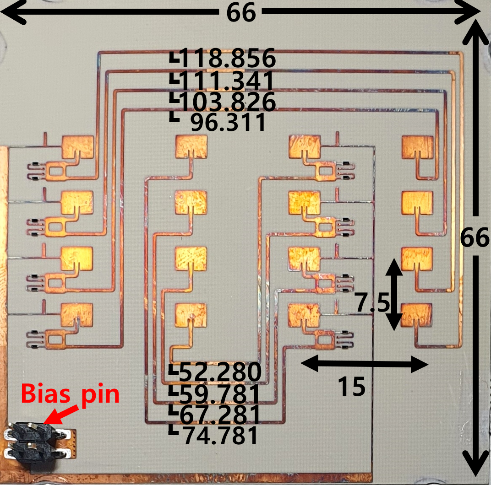

# Hawkeye
MobiSys '23, Hawkeye: Hectometer-range Subcentimeter Localization for Large-scale mmWave Backscatter

Consists of two folders.
The Hardware folder contains the Hawkeye tag design file, which can be opened using HFSS software.
The Software folder contains the Hawkeye super-resolution algorithm file in matlab, which works with EVAL-TINYRAD from Analog Devices.

You can find the sample inputs for Hawkeye super-resolution algorithm at https://drive.google.com/file/d/1dW7adJCa1oWd-Ku77HN8pgqjcEb8F1y5/view?usp=share_link.

We note that we do not upload the files provided by Analog Devices, due to possible copyright issues.

**The code is currently being modified for clarity.**

## Hawkeye HardWare Design
### Design Overview
</img>
Hawkeye backscatter tag is a planar Van Atta Array (VAA) combined with a power-efficient low-loss FSK modulator using a hybrid coupler.
The tag retro-reflects in both azimuth (90° FoV) and elevation (140° FoV).
Hawkeye tag is tuned to demonstrate S11 of -10 dB throughout the entire 250 MHz bandwidth, where FSK modulation is performed by the combination of reflective network and low-loss 90° hybrid coupler co-optimized for efficient VAA reflection. 
The use of the VAA, along with the severe signal attenuation of the mmWave, naturally suppresses the multipath interference. To the best of our knowledge, Hawkeye tag is the first planar VAA mmWave backscatter design with modulation capability.

### High-level Operation
The tag retro-reflects the incident signal with FSK modulation, by periodically toggling between two signal paths (with different lengths) on each centrosymmetric antenna pair. The modulator is a combination of hybrid coupler and reflective network that yields a $180^\circ$ phase flip with path switching. Both paths are impedance-matched for low-loss modulation, where this feature applies across all antenna pairs for retro-reflectivity under FSK. In the following, we present details on the tag structure and specifics on our design choices.

### Hardware Design Details

__*(1) Antenna Design*__
  The antenna parameters are optimized to achieves S11 of -10 dB throughout the entire 250 MHz bandwidth (24GHz-24.125GHz). Specifically, patch dimension and edge notch depth (antenna feeding point) is optimized to 50 Ω (TL's impedance).

__*(2) Modulator Design*__
  Hawkeye modulator uses PIN diode (MADP-000907-14020) whose equivalent circuit is represented in R, L, and C components. The effect of diode is simulated via lumped RLC boundary in HFSS. 

__*(3) VAA Design*__
  To keep the VAA retro-reflectivity, all TLs should induce the same phase shift. To do this, we follows below process. (1) we checked the S21 of TLs first and optimized each TL length as they have equally induced phases. (2) Later, we attached the modulator and 
optimized the TL lengths and gaps between TLs to compensate for the coupling effect between the modulator and the TLs. (3) Lastly, we combined the antenna with modulator & TL, and checked the retro-reflectivity performance via the Monostatic RCS plot of HFSS, with Incident wave excitation.